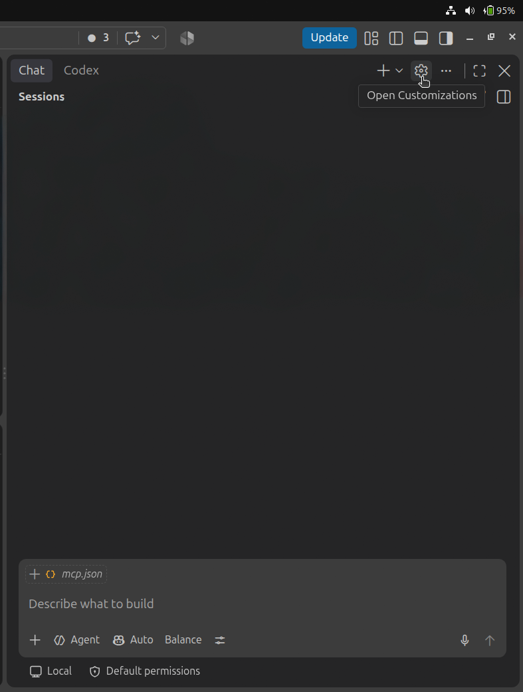
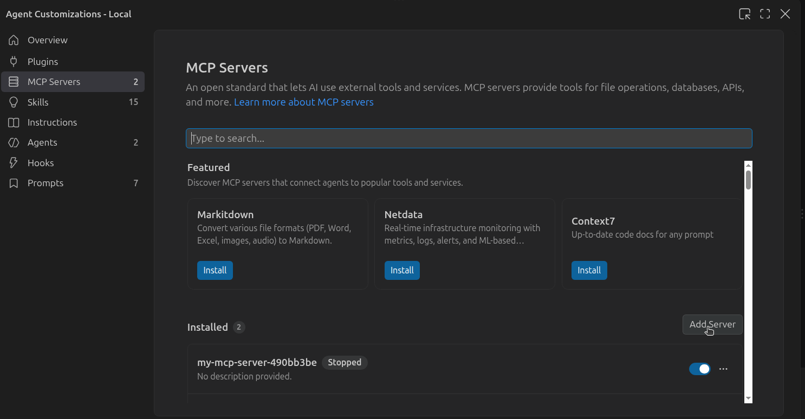
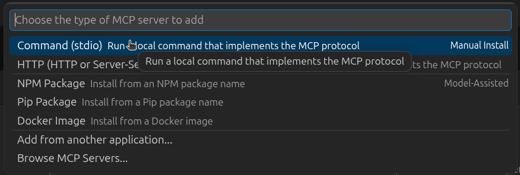
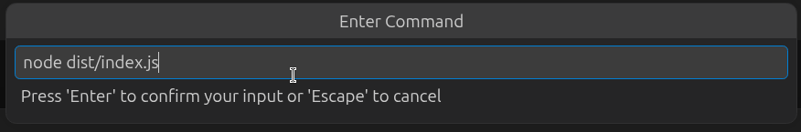
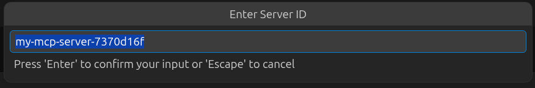
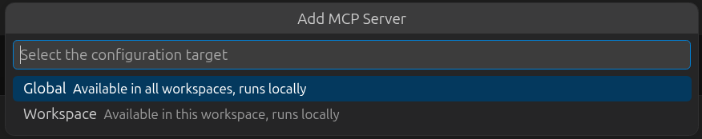

# 02 — Use the stdio MCP server with GitHub Copilot

In this lesson, you will connect the server from [lesson 01](../01-hello-mcp-stdio) to GitHub Copilot in VS Code.

You are not creating another server here. GitHub Copilot will start the lesson 01 server locally and communicate with it through **stdio**.

## What you will learn

- how to build an MCP server before connecting it to a client
- how to add a local stdio MCP server in VS Code
- how to confirm that GitHub Copilot discovered the server tools
- how to ask Copilot to use `greet` and `getWeatherData`

## Before you start

You need:

- VS Code
- Node.js installed
- the repository opened locally in VS Code

## Step 1: Install GitHub Copilot

In VS Code, open the **Extensions** view and install the **GitHub Copilot** extension. Sign in to GitHub if VS Code asks you to do so.

## Step 2: Build the lesson 01 server

First, build the server that GitHub Copilot will run.

From the repository root, run:

```bash
cd examples/01-hello-mcp-stdio
npm install
npm run build
```

This creates `dist/index.js`, the JavaScript file that the MCP client starts.

## Step 3: Open MCP Servers

In VS Code:

1. Select the gear icon in the lower-left corner.
2. In the menu that opens, select **MCP Servers**.
3. In the MCP Servers view, select **Add Server**.

> **Screenshot:** The VS Code gear menu with **MCP Servers** highlighted.



## Step 4: Choose the server transport

VS Code will ask how the MCP server should connect. Choose **Command (stdio)**.

This is the correct choice because lesson 01 is a local server that GitHub Copilot starts with a command.

> **Screenshot:** The transport selection menu with **Command (stdio)** selected.


## Step 5: Enter the command

VS Code will ask for the command that starts the server. Enter `node`, followed by the full path to the compiled `index.js` file from lesson 01.

The file is created in `dist/` after running `npm run build`.

```text
node /absolute/path/to/MCP For Starters/examples/01-hello-mcp-stdio/dist/index.js
```

For example, on this project’s current machine, the command is:

```text
node /home/qamarzama/MCP For Starters/examples/01-hello-mcp-stdio/dist/index.js
```

Press Enter after entering the command.

> **Screenshot:** The command entry box showing the Node.js command and the full path to `dist/index.js`.


## Step 6: Name the server

VS Code will ask you to give the server a name. Use a clear name such as:

```text
mcp-for-starters
```

> **Screenshot:** The server-name prompt with `mcp-for-starters` entered.


## Step 7: Choose where the server configuration is saved

VS Code will ask whether this server should be available globally or only in the current workspace.

- Choose **Global** if you want to use this server from any VS Code project on your computer.
- Choose **Workspace** if you want the configuration to be available only when this repository is open.

For this learning project, **Workspace** is a good choice because the server path belongs to this repository.

> **Screenshot:** The Global or Workspace selection prompt.


## Step 8: Start the server

After saving the configuration, find `mcp-for-starters` in the MCP Servers view and start it.

If VS Code asks you to restart or reload after changing the configuration, do that before continuing.

## Step 9: Chat with GitHub Copilot

Open GitHub Copilot Chat and switch to **Agent** mode. Agent mode can discover and call tools from connected MCP servers.

Ask Copilot:

```text
Use the greet tool to greet Ada.
```

Copilot should offer to call, or call, the `greet` tool and return:

```text
Hello, Ada!
```

## Step 6: Call the weather tool

Now ask Copilot:

```text
Use the getWeatherData tool to get the weather in London.
```

The lesson 01 server returns simulated weather data, so the response should say:

```text
The weather in London is sunny.
```

## What happened?

GitHub Copilot acted as the MCP client. It started your local Node.js server with the command in `mcp.json`, discovered the tools that the server registered, and called them with the input from your prompt.

```text
Copilot Chat → MCP client → lesson 01 stdio server → tool result → Copilot Chat
```

## Troubleshooting

- **The server does not appear:** Confirm the path in `args` is absolute and points to `dist/index.js`.
- **The server will not start:** Run `npm run build` again inside `examples/01-hello-mcp-stdio`.
- **`node` is not found:** Install Node.js, then restart VS Code so it can find the command.
- **Copilot does not call the tool:** Ensure you are using Agent mode and that the MCP server is running.

## Next step

You have connected a local stdio MCP server to an AI client. The next lessons can add more tools, call real APIs, and eventually introduce a remote Streamable HTTP server.